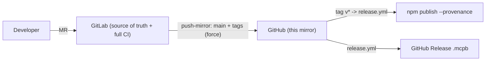

# Contributing

## Repository model

This GitHub repository is a **downstream mirror**. The source of truth is
Kadam's internal GitLab repository, which runs the full CI pipeline (quality,
architecture, security, tests, build, Docker image). Only the protected `main`
branch and version tags are mirrored here, and the mirror force-syncs `main`:
**anything pushed directly to GitHub is overwritten** on the next sync.



- Do all development via merge requests against the internal GitLab repo.
- Do not push branches/commits directly to GitHub — they will be discarded.
- Community PRs on GitHub are welcome; they are reviewed and re-applied
  internally, then flow back out through the mirror.

## Releasing

1. Bump `version` in `package.json` and merge to `main` (in GitLab).
2. Push a tag `vX.Y.Z` in GitLab.
3. The mirror propagates the tag to GitHub, where
   [.github/workflows/release.yml](.github/workflows/release.yml) publishes the
   npm package (with OIDC provenance) and uploads the `.mcpb` to a GitHub
   Release.

npm publishing intentionally lives on GitHub Actions: npm provenance/OIDC is not
available from self-hosted GitLab.

## Local checks

Run the same gates CI enforces:

```bash
npm run lint && npm run format:check && npm run typecheck
npm run check:file-sizes && npm run check:tool-naming && npm run check:imports
npm run audit:deps && npm run audit:licenses
npm run test:unit && npm run test:integration && npm run test:isolation
npm run build && npm run check:bundle-size
```
