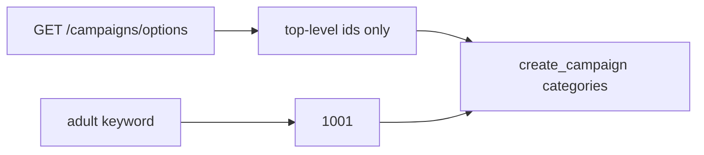

# KUI-6658 — campaign category targeting (MCP)

## Before

Default create flattened every numeric category id from options, including
Mainstream children. Create now rejects those IDs.

## After

- Default targeting is `[1001, "mainstream"]` (top-level option ids).
- `adult` in `categories` becomes `1001`.
- Reference resource describes Adult tree + `mainstream` token.

## Touched interfaces

- `flattenCategoryIds`
- `kadam_adv_create_campaign` / `kadam_adv_update_campaign` `categories`
- `kadam://reference/categories`
